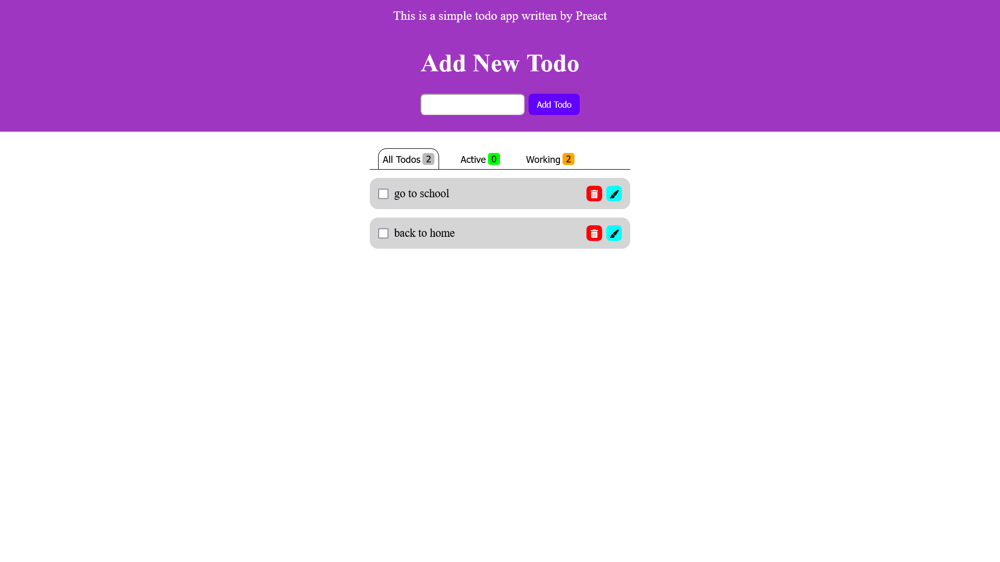

# Installation

 First you should clone it from https://github.com/mohammad-mohammadi88/Preact-todo-app
 with command `git clone https://github.com/mohammad-mohammadi88/Preact-todo-app` and start using it.

# Technologies
We used Preact to show that we have some knowledge about it. Also we used pure html and css(with no frameworks or libraries), and mostly used [tsx](https://docs.fileformat.com/programming/tsx/) format to develop with [typescript](https://www.typescriptlang.org/) to make it more readable for developers.The server was created by [javascript](https://www.javascript.com/) and [express](https://expressjs.com/).

# Usage
when you clone  it from [github](https://github.com) you will see [vite](https://vite.dev/) [Preact](https://preactjs.com) codes and a server file that I created for sending requests and saving data. You can start server with commands

    npm run server
    #or
    yarn server
and start developing the project with commands

    npm run dev
    #or 
    yarn dev
and you can start them with a single command of

    npm start
but to use this first you  should install [concurrently](https://www.npmjs.com/package/concurrently) package from [npm](https://www.npmjs.com) or [yarn](com) as global.

# server

The server is very simple and easy to use. It was made by [nodejs](https://nodejs.org/en) and [express framework](https://expressjs.com/).
Because it is a simple project, we did not use database to save data, so there is a data folder and inside of it there is a todos.json file to use it as database.
You can even just copy the server and write your own front-end and if you have knowledge about [nodejs](https://nodejs.org/en) and [expressjs](https://expressjs.com/) you develop is easily.

# I sample Image

# conclusion
This simple todo project is a awesome way to test your skills.
I hope it might be useful for you.
